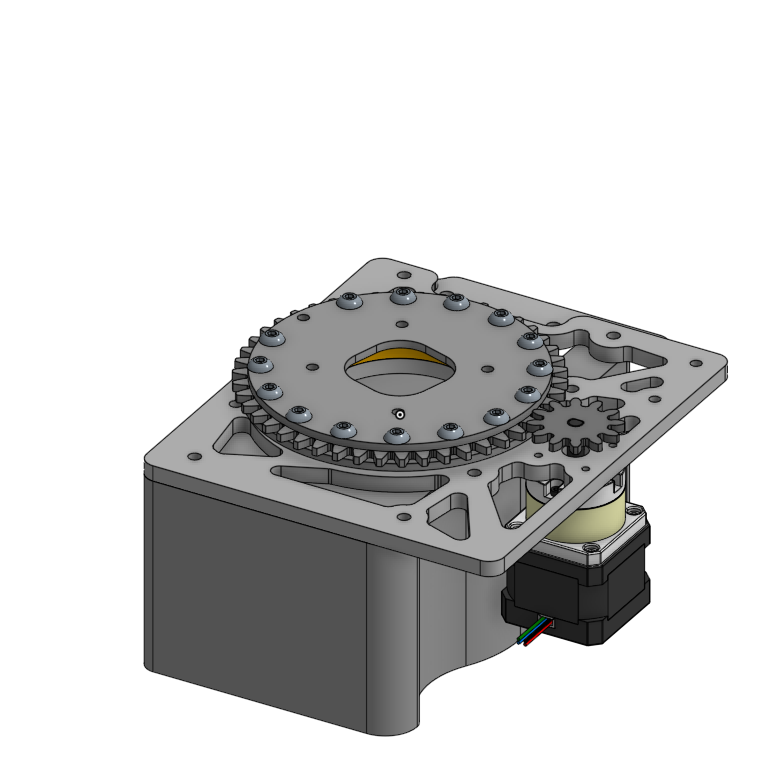
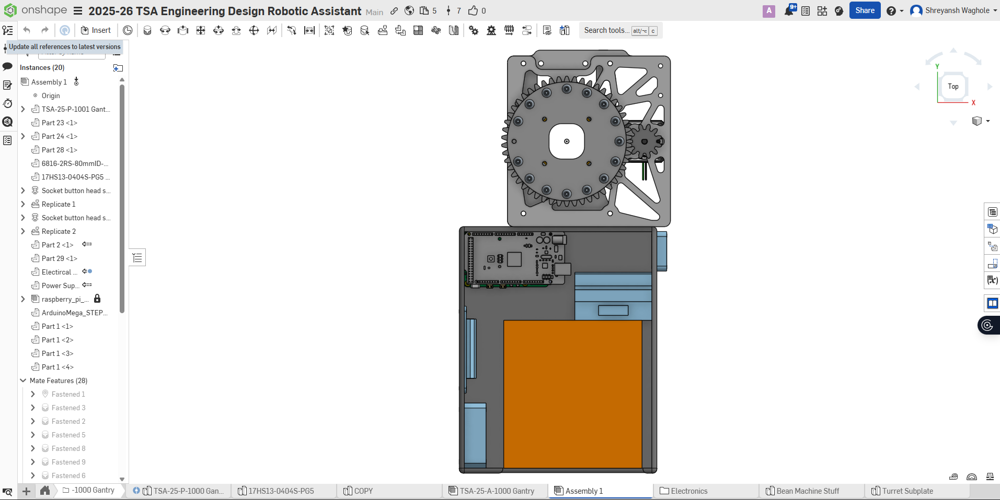
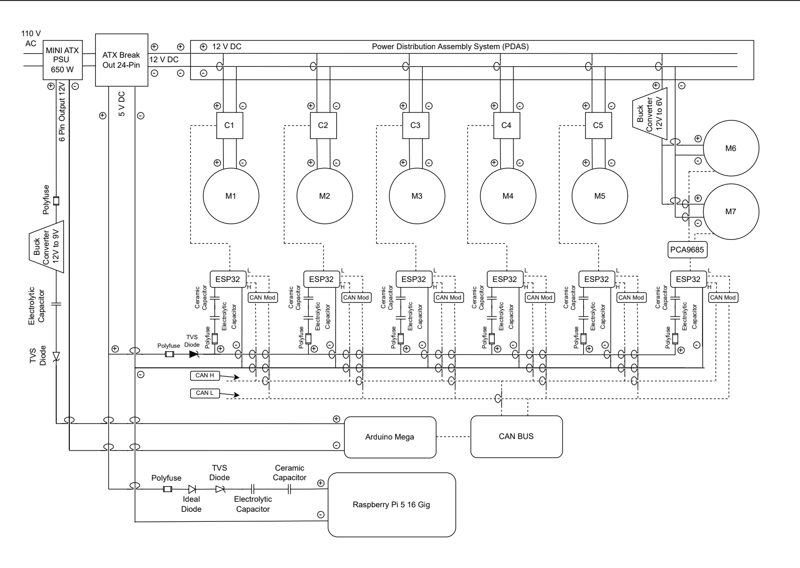
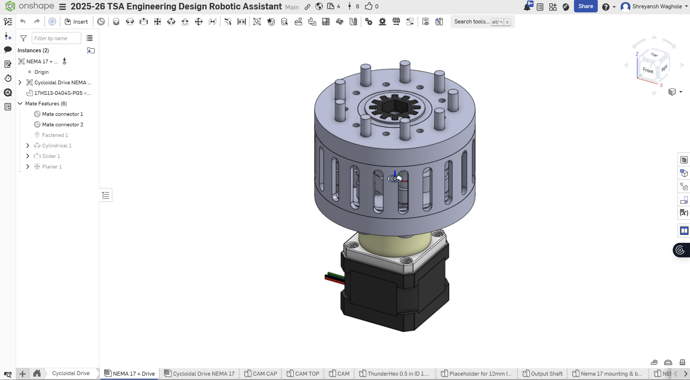
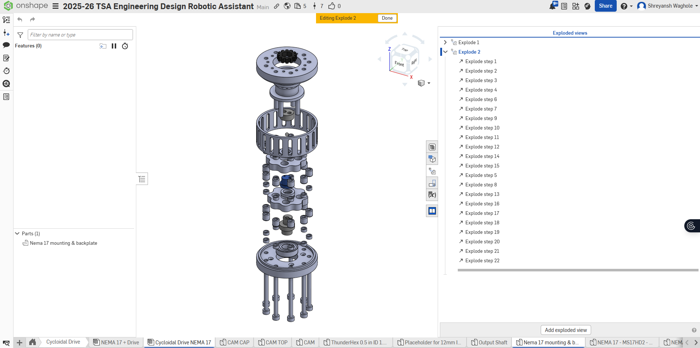
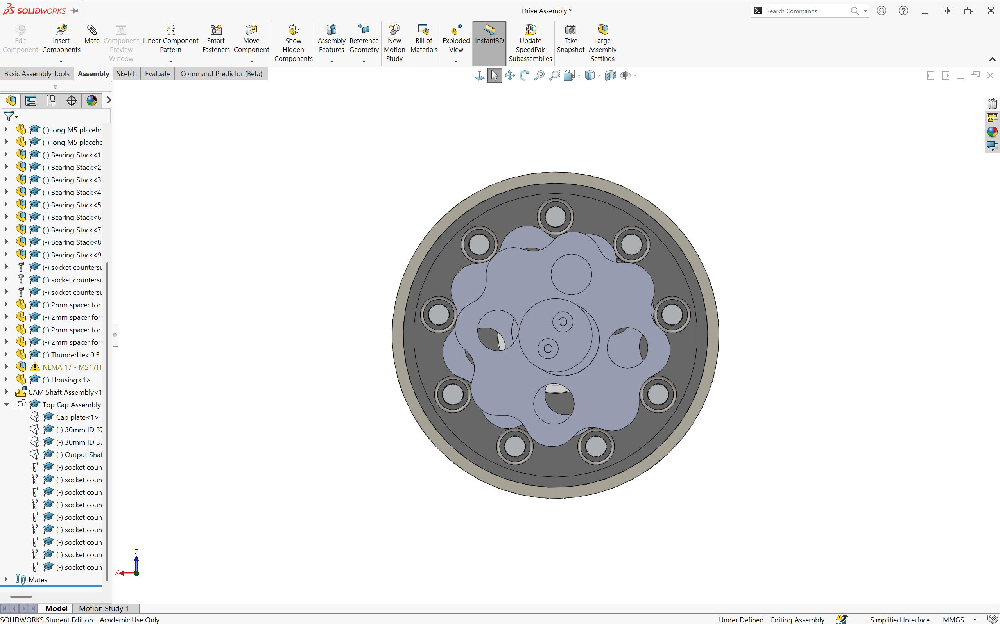
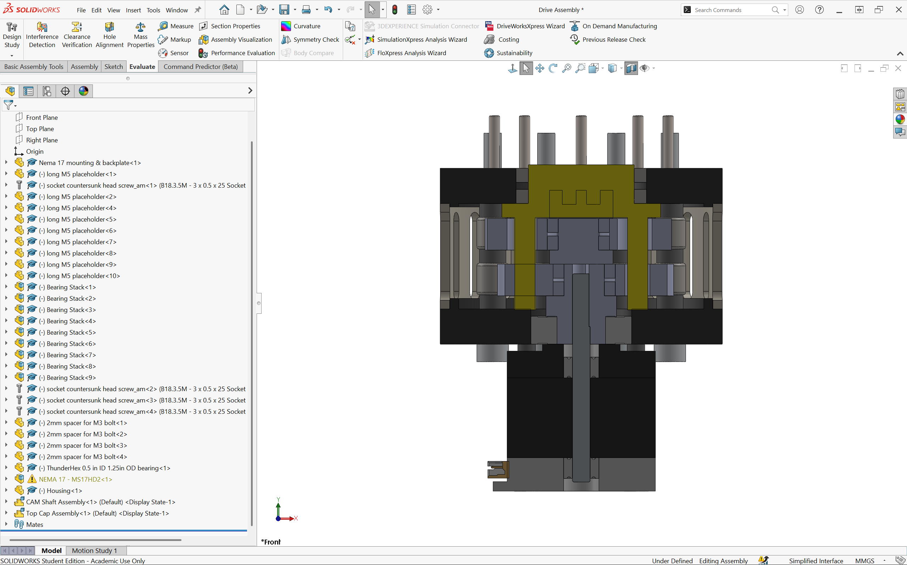
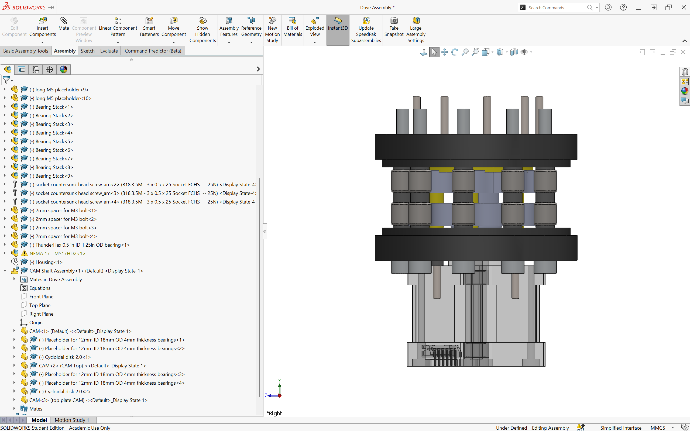
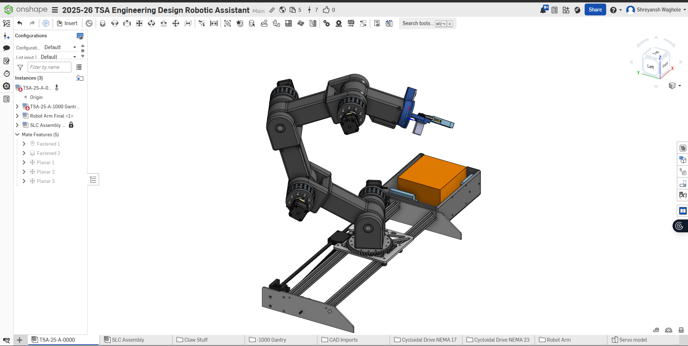
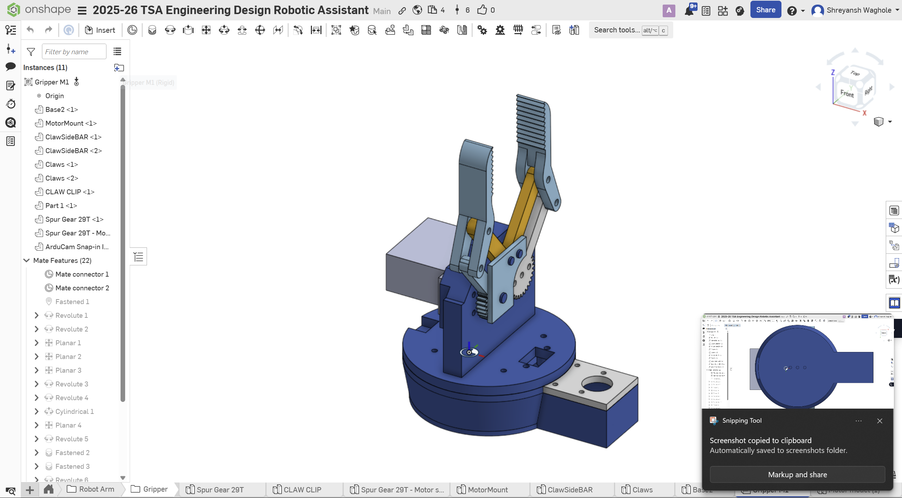

# AI Powered Robotic Arm Lab Assistant

## What It Is

Our team proposes a low-cost, highly accessible lab robotic arm intended for use by students, educators, and small scale labs around the world. This design addresses the lack of access to advanced laboratory automation technologies in underfunded educational and research environments. By implementing additive manufacturing through 3D printing, open source electronics, and wide range mobility, the platform serves as a flexible, modular, and easily accessible laboratory assistant suitable for both instructional and research applications.   
Because the arm is primarily created using 3D printed components, the overall cost is reduced by approximately 90% compared to a commercially available lab assistant robot. This substantial cost reduction allows for schools, communities, and institutions to create multiple units, therefore increasing accessibility and supporting hands on, scalable learning experiences.  
All mechanical designs, electronic schematics, and software components have been released as open source materials. Users can independently manufacture the arm, replace individual components as needed, and modify the design files as per their own needs. This open framework also supports a collaborative ecosystem for shared enhancements, including the addition of new grippers, sensors, tools, and automation scripts, allowing for continuous improvements to the design.   
The robotic arm was designed with a strong emphasis on its mechanical simplicity, flexibility, and ease of construction. A 7 degree of freedom (DOF) configuration was used to create a range of motion beyond that of a human arm, allowing the system to reach complex orientations. All of the components were modeled using computer aided design (CAD), allowing for precision, control over joint geometry, and tolerances. Cycloidal drive mechanisms are implemented into the assemblies to provide high torque and smooth motion while mitigating or significantly reducing backlash, improving the overall positioning accuracy during laboratory tasks. The design of the end effector allows users to replace individual components, attach custom tools, and even integrate new sensors without having to redesign the entire system.  
	The robotic arm uses an integrated Controller Area Network (CANBUS) communication system to simplify the signal processing and reduce the amount of internal cabling required. In addition to its communication architecture, the system incorporates computer vision using a YOLOv11-based object detection model. Overall, these features improve system efficiency while supporting scalable and adaptable laboratory automation. 

## Why We Made This

   We designed this robotic arm to fill a major gap that we observed in educational and laboratory environments. Most advanced tools that assist with automating procedures are extremely expensive and proprietary, which makes  them inaccessible to students and researchers who work in small scale labs who need the most help from this technology. Though the industrial level robotic arms are relatively common in well funded labs and non-educational environments, their high cost and closed ecosystems make the technology significantly less viable to classrooms that could possibly use this as an educational tool, community labs, and underfunded research labs.   
   In many labs, repetitive tasks like pipetting, sample transfers, positioning instruments, and handling hazardous materials are done manually by the researchers. This seriously limits the possible efficiency of the lab and increases the likelihood of fatigue, human error, and safety hazards. The current industry systems that could automate these tasks cost tens of thousands of dollars and need hgihly specialized maintenance because of their closed off design, which makes them very unrealistic for small scale labs and most schools.   
   Our main goal with this design was to create a robotic arm that will help significantly reduce the entry barrier to this technology while still remaining functional and precise. By prioritizing the ability to 3D print the majority of the components, open source electronics, and the modular design, we were able to reduce the cost by almost 90% while still creating a highly capable robotic assistant. This arm can be scaled up into a system of communicating assistive devices that can work together. The reduced cost also makes it possible for a high level lab to deploy several of these arms in comparison to a single high cost version. This system will help schools with low funding and small labs create a much more hands on learning environment, run parallel experiments, and scale their automation of tasks.   
   We chose to make this project fully open source with minimal protections (Reference MIT Licence, txt and CERN Open Hardware Licence Version - Permissive.txt) because we believe that the development  and usage of this technology should not be limited by proprietary constraints like the majority of mainstream robotics technologies. By releasing all of the CAD files, schematics, and software that we have, we hope that the users of this repository will understand the system itself, repair it on their own, and adapt or even improve on our work. We hope that this approach will encourage learning robotics through doing and designing independently. We would love for the global community on GitHub to improve the design over time by creating new end effectors, tools, control strategies, and AI implementations.   
   Overall, this robotic arm was designed to spread lab automation. It was created to not just be a tool for innovation but also a platform for developing independent work. We hope that our contribution and efforts here will support education, research, and lab automation by making advanced robotic technologies significantly more affordable and customizable to anyone in the community willing to learn and build this technology further. 

## CAD Viewer

<!-- <model-viewer 
  src="https://akkified.github.io/tsa-engineering-design/cad/model.glb" 
  alt="Interactive CAD model" 
  auto-rotate 
  camera-controls 
  ar 
  style="width: 100%; height: 400px;">
</model-viewer> -->

## Images

### 3D CAD Model

### Wiring Diagram

### AI Performance (Vision)

### Cycloidal

### Gripper

## Bill of Materials

| Item | Description | Quantity | Link |
| :--- | :--- | :--- | :--- |
| TSA-26-P-1001 | Gantry Cart Plate | 1 | [Link](https://cad.onshape.com/documents/f3370c452f54d75f3c4d6ebc/w/d75891e42061a97cb25fbb77/e/19dbb1aef07b81d3e2e158b9?renderMode=0&uiState=695c746370159ed098bd85ad) |
| TSA-26-P-1002 | Gantry Side Plate | 1 | [Link](https://cad.onshape.com/documents/f3370c452f54d75f3c4d6ebc/w/d75891e42061a97cb25fbb77/e/19dbb1aef07b81d3e2e158b9?renderMode=0&uiState=695c746370159ed098bd85ad) |
| TSA-26-P-1003 | Gantry Side Plate 2  | 1 | [Link](https://cad.onshape.com/documents/f3370c452f54d75f3c4d6ebc/w/d75891e42061a97cb25fbb77/e/19dbb1aef07b81d3e2e158b9?renderMode=0&uiState=695c746370159ed098bd85ad) |
| TSA-26-P-1004 | Bottom Belt Clamp | 1 | [Link](https://cad.onshape.com/documents/f3370c452f54d75f3c4d6ebc/w/d75891e42061a97cb25fbb77/e/19dbb1aef07b81d3e2e158b9?renderMode=0&uiState=695c746370159ed098bd85ad) |
| TSA-26-P-1005 | Top Gantry Clamp | 1 | [Link](https://cad.onshape.com/documents/f3370c452f54d75f3c4d6ebc/w/d75891e42061a97cb25fbb77/e/19dbb1aef07b81d3e2e158b9?renderMode=0&uiState=695c746370159ed098bd85ad) |
| TSA-26-P-1006 | Gantry Drive Block | 1 | [Link](https://cad.onshape.com/documents/f3370c452f54d75f3c4d6ebc/w/d75891e42061a97cb25fbb77/e/19dbb1aef07b81d3e2e158b9?renderMode=0&uiState=695c746370159ed098bd85ad) |
| TSA-26-P-1007 | Idler Drive Block | 1 | [Link](https://cad.onshape.com/documents/f3370c452f54d75f3c4d6ebc/w/d75891e42061a97cb25fbb77/e/19dbb1aef07b81d3e2e158b9?renderMode=0&uiState=695c746370159ed098bd85ad) |
| TSA-26-P-1008 | Stepper Drive Shaft | 1 | [Link](https://cad.onshape.com/documents/f3370c452f54d75f3c4d6ebc/w/d75891e42061a97cb25fbb77/e/19dbb1aef07b81d3e2e158b9?renderMode=0&uiState=695c746370159ed098bd85ad) |
| TSA-26-P-1009 | Sideplate Support Block | 1 | [Link](https://cad.onshape.com/documents/f3370c452f54d75f3c4d6ebc/w/d75891e42061a97cb25fbb77/e/19dbb1aef07b81d3e2e158b9?renderMode=0&uiState=695c746370159ed098bd85ad) |
| TSA-26-P-1010 | Idler Pulley Shaft | 1 | [Link](https://cad.onshape.com/documents/f3370c452f54d75f3c4d6ebc/w/d75891e42061a97cb25fbb77/e/19dbb1aef07b81d3e2e158b9?renderMode=0&uiState=695c746370159ed098bd85ad) |
| TSA-26-P-1011 | Gantry Motor Plate | 1 | [Link](https://cad.onshape.com/documents/f3370c452f54d75f3c4d6ebc/w/d75891e42061a97cb25fbb77/e/19dbb1aef07b81d3e2e158b9?renderMode=0&uiState=695c746370159ed098bd85ad) |
| TSA-26-P-1012 | Top Idler Shaft | 1 | [Link](https://cad.onshape.com/documents/f3370c452f54d75f3c4d6ebc/w/d75891e42061a97cb25fbb77/e/19dbb1aef07b81d3e2e158b9?renderMode=0&uiState=695c746370159ed098bd85ad) |
| TSA-26-P-1013 | Bearing Clamp Block | 1 | [Link](https://cad.onshape.com/documents/f3370c452f54d75f3c4d6ebc/w/d75891e42061a97cb25fbb77/e/19dbb1aef07b81d3e2e158b9?renderMode=0&uiState=695c746370159ed098bd85ad) |
| TSA-26-P-1014 | Turret Mega Gear | 1 | [Link](https://cad.onshape.com/documents/f3370c452f54d75f3c4d6ebc/w/d75891e42061a97cb25fbb77/e/19dbb1aef07b81d3e2e158b9?renderMode=0&uiState=695c746370159ed098bd85ad) |
| TSA-26-P-1015 | Turret Top Face Plate | 1 | [Link](https://cad.onshape.com/documents/f3370c452f54d75f3c4d6ebc/w/d75891e42061a97cb25fbb77/e/19dbb1aef07b81d3e2e158b9?renderMode=0&uiState=695c746370159ed098bd85ad) |
| TSA-26-P-1016 | Turret Stepper Spur Gear | 1 | [Link](https://cad.onshape.com/documents/f3370c452f54d75f3c4d6ebc/w/d75891e42061a97cb25fbb77/e/19dbb1aef07b81d3e2e158b9?renderMode=0&uiState=695c746370159ed098bd85ad) |
| TSA-26-P-1017 | 16T HTD Pulley | 1 | [Link](https://cad.onshape.com/documents/f3370c452f54d75f3c4d6ebc/w/d75891e42061a97cb25fbb77/e/19dbb1aef07b81d3e2e158b9?renderMode=0&uiState=695c746370159ed098bd85ad) |
| TSA-26-P-1018 | 12T HTD Pulley | 2 | [Link](https://cad.onshape.com/documents/f3370c452f54d75f3c4d6ebc/w/d75891e42061a97cb25fbb77/e/19dbb1aef07b81d3e2e158b9?renderMode=0&uiState=695c746370159ed098bd85ad) |
| V-Slot 20x20x500 Linear Rail | V-Slot 20x20x500 Linear Rail | 2 | [Link](amazon.com/Seekliny-Aluminum-Extrusion-V-Slotted-Accessories/dp/B0DY7HTF64/ref=sr_1_4?crid=2XZJS4FL1F96O&dib=eyJ2IjoiMSJ9.Ac3P7DHsJClEaBba3uS4z0TF3Njk0aX5qsHx9eAZKVYe0E3uR7Y7049Nr2TUYWWROzSkqay74nQcwlPM9SRy9RS-nazLpZmBX2XZMilzl5ezOM1P1l5QNxDUTyvYWSvyw5T_pdYnNHySHUVVmbdfHIc-dCnuMA5W4nbLpQkIYnH0eTH-YCFQywWMR9SoS_m9iueO_Zvjn_C2PwxK7_1OM0MnLjR6LqhkJFpIY-68bDU.rM0o6ytShiE_gbBSqp4TNnfBsuJUcUOJwdTYlyX93-0&dib_tag=se&keywords=V-Slot+20x20x500+Linear+Rail&qid=1767666841&sprefix=v-slot+20x20x500+linear+rail%2Caps%2C157&sr=8-4) |
| WCP-0643 | 250T 5M 9mm Wide Belt | 1 | [Link](https://wcproducts.com/products/htd-timing-belts-9mm-width) |
| 17HS13-0404S-PG5 | Nema 17 Stepper Motor Bipolar L=34mm w/ Gear Ratio 14:1 Planetary Gearbox | 2 | [Link](https://www.amazon.com/gp/product/B00QA8XUGC/ref=ox_sc_act_title_10?smid=AWQBCGWISS7BL&psc=1) |
| 6816-2RS-80mm | Ball Bearing 80x100x10mm Sealed | 1 | [Link](https://www.amazon.com/gp/product/B07RQ4RXDR/ref=ox_sc_act_title_4?smid=A1THAZDOWP300U&th=1) |
| TSA-26-P-2001 | Cam Shaft Cap | 4 | [Link](https://cad.onshape.com/documents/f3370c452f54d75f3c4d6ebc/w/d75891e42061a97cb25fbb77/e/19dbb1aef07b81d3e2e158b9?renderMode=0&uiState=695c746370159ed098bd85ad) |
| TSA-26-P-2002 | Cam Shaft Upper | 4 | [Link](https://cad.onshape.com/documents/f3370c452f54d75f3c4d6ebc/w/d75891e42061a97cb25fbb77/e/19dbb1aef07b81d3e2e158b9?renderMode=0&uiState=695c746370159ed098bd85ad) |
| TSA-26-P-2003 | Cam Shaft Lower | 4 | [Link](https://cad.onshape.com/documents/f3370c452f54d75f3c4d6ebc/w/d75891e42061a97cb25fbb77/e/19dbb1aef07b81d3e2e158b9?renderMode=0&uiState=695c746370159ed098bd85ad) |
| TSA-26-P-2004 | ThunderHex 0.5 in ID 1.25in OD bearing | 4 | [Link](https://wcproducts.com/products/wcp-0778?variant=35666611994784) |
| TSA-26-P-2005 | 12mm ID 18mm OD 4mm thickness bearings | 16 | [Link](https://www.amazon.com/gp/product/B082PQ8DC2/ref=ox_sc_act_title_28?smid=A30WUG2ZDGM0XM&psc=1) |
| TSA-26-P-2006 | Output Shaft | 4 | [Link](https://cad.onshape.com/documents/f3370c452f54d75f3c4d6ebc/w/d75891e42061a97cb25fbb77/e/19dbb1aef07b81d3e2e158b9?renderMode=0&uiState=695c746370159ed098bd85ad) |
| TSA-26-P-2007 | Backplate | 4 | [Link](https://cad.onshape.com/documents/f3370c452f54d75f3c4d6ebc/w/d75891e42061a97cb25fbb77/e/19dbb1aef07b81d3e2e158b9?renderMode=0&uiState=695c746370159ed098bd85ad) |
| TSA-26-P-2008 | M5 * 60mm Hex Socket Head Cap Screw | 36 | [Link](https://www.aliexpress.us/item/3256805692722422.html?spm=a2g0o.detail.similar_items.1.962eZvftZvftMR&utparam-url=scene%3Aimage_search%7Cquery_from%3Aapp_pdp_sold_out%7Cx_object_id%3A1005005879037174%7C_p_origin_prod%3A&algo_pvid=d06de017-0032-439f-90b5-96b5dae6599d&algo_exp_id=d06de017-0032-439f-90b5-96b5dae6599d&pdp_ext_f=%7B%22order%22%3A%227764%22%2C%22fromPage%22%3A%22search%22%7D&pdp_npi=6%40dis%21USD%211.13%210.99%21%21%211.13%210.99%21%40210319b017693045113938360e7a26%2112000034679037238%21sea%21US%210%21ABX%211%210%21n_tag%3A-29910%3Bd%3A70849a7%3Bm03_new_user%3A-29895%3BpisId%3A5000000197831554&gatewayAdapt=4itemAdapt) |
| TSA-26-P-2009 | Housing | 4 | [Link](https://cad.onshape.com/documents/f3370c452f54d75f3c4d6ebc/w/d75891e42061a97cb25fbb77/e/19dbb1aef07b81d3e2e158b9?renderMode=0&uiState=695c746370159ed098bd85ad) |
| TSA-26-P-2010 | Cycloidal Disk | 8 | [Link](https://cad.onshape.com/documents/f3370c452f54d75f3c4d6ebc/w/d75891e42061a97cb25fbb77/e/19dbb1aef07b81d3e2e158b9?renderMode=0&uiState=695c746370159ed098bd85ad) |
| TSA-26-P-2011 | 5mm ID 9mm OD needle roller bearings | 72 | [Link](https://www.aliexpress.us/item/3256804660266970.html?src=google&pdp_npi=4%40dis%21USD%213.41%212.73%21%21%21%21%21%40%2112000030724372261%21ppc%21%21%21&src=google&albch=shopping&acnt=708-803-3821&isdl=y&slnk=&plac=&mtctp=&albbt=Google_7_shopping&aff_platform=google&aff_short_key=UneMJZVf&gclsrc=aw.ds&albagn=888888&ds_e_adid=&ds_e_matchtype=&ds_e_device=c&ds_e_network=x&ds_e_product_group_id=&ds_e_product_id=en3256804660266970&ds_e_product_merchant_id=615288785&ds_e_product_country=US&ds_e_product_language=en&ds_e_product_channel=online&ds_e_product_store_id=&ds_url_v=2&albcp=20123152476&albag=&isSmbAutoCall=false&needSmbHouyi=false&gad_source=1&gad_campaignid=20127768206&gbraid=0AAAAAD6I-hE_c0bNYItsRKS4sV74GX0Em&gclid=Cj0KCQiA-NHLBhDSARIsAIhe9X1RkK1M3zWoqeKVoTKC5Vww6jVYlcepzKd-19evBhiQjUbhHgSE73AaAhCaEALw_wcB&gatewayAdapt=glo2usa) |
| TSA-26-P-2012 | Cap Plate | 4 | [Link](https://cad.onshape.com/documents/f3370c452f54d75f3c4d6ebc/w/d75891e42061a97cb25fbb77/e/19dbb1aef07b81d3e2e158b9?renderMode=0&uiState=695c746370159ed098bd85ad) |
| TSA-26-P-2013 | Ball Bearings Z2 30mm x 37mm x 4mm | 8 | [Link](https://www.aliexpress.us/item/2255800723290638.html?src=google&pdp_npi=4%40dis%21USD%212.79%212.79%21%21%21%21%21%40%2112000028447926017%21ppc%21%21%21&src=google&albch=shopping&acnt=708-803-3821&isdl=y&slnk=&plac=&mtctp=&albbt=Google_7_shopping&aff_platform=google&aff_short_key=UneMJZVf&gclsrc=aw.ds&albagn=888888&ds_e_adid=&ds_e_matchtype=&ds_e_device=c&ds_e_network=x&ds_e_product_group_id=&ds_e_product_id=en2255800723290638&ds_e_product_merchant_id=106987257&ds_e_product_country=US&ds_e_product_language=en&ds_e_product_channel=online&ds_e_product_store_id=&ds_url_v=2&albcp=19699543385&albag=&isSmbAutoCall=false&needSmbHouyi=false&gad_source=1&gad_campaignid=19691574624&gbraid=0AAAAAD6I-hFV_emhCKMJOEfGiLbDBBOBc&gclid=Cj0KCQiA-NHLBhDSARIsAIhe9X38E8wk384lz9ETZ11OgR0fG5e9S9948ML7Y-YlSKKG4d1FBxTXTZsaAkLsEALw_wcB&gatewayAdapt=glo2usa) |
| TSA-26-P-2014 | 4mm Spacer for M5 | 108 | [Link](https://cad.onshape.com/documents/f3370c452f54d75f3c4d6ebc/w/d75891e42061a97cb25fbb77/e/19dbb1aef07b81d3e2e158b9?renderMode=0&uiState=695c746370159ed098bd85ad) |
| TSA-26-P-2015 | 3D-Print Adapter (1/2" Hex Bore, Thrifty Profile) | 4 | [Link](https://wcproducts.com/products/wcp-1121?variant=44283598045396) |
| TSA-26-P-2016 | Nema 17 Stepper Motor Bipolar L=34mm w/ Gear Ratio 14:1 Planetary Gearbox | 4 | [Link](https://www.amazon.com/gp/product/B00QA8XUGC/ref=ox_sc_act_title_10?smid=AWQBCGWISS7BL&psc=1) |
| TSA-26-P-3001 | Base Arm Segment | 3 | [Link](https://cad.onshape.com/documents/f3370c452f54d75f3c4d6ebc/w/d75891e42061a97cb25fbb77/e/19dbb1aef07b81d3e2e158b9?renderMode=0&uiState=695c746370159ed098bd85ad) |
| TSA-26-P-3002 | Arm segment Cap Plate | 4 | [Link](https://cad.onshape.com/documents/f3370c452f54d75f3c4d6ebc/w/d75891e42061a97cb25fbb77/e/19dbb1aef07b81d3e2e158b9?renderMode=0&uiState=695c746370159ed098bd85ad) |
| TSA-26-P-3003 | Gripper Mount Arm Segment | 1 | [Link](https://cad.onshape.com/documents/f3370c452f54d75f3c4d6ebc/w/d75891e42061a97cb25fbb77/e/19dbb1aef07b81d3e2e158b9?renderMode=0&uiState=695c746370159ed098bd85ad) |
| TSA-26-P-3004 | Turret Mounted Arm Segment | 1 | [Link](https://cad.onshape.com/documents/f3370c452f54d75f3c4d6ebc/w/d75891e42061a97cb25fbb77/e/19dbb1aef07b81d3e2e158b9?renderMode=0&uiState=695c746370159ed098bd85ad) |
| TSA-26-P-4001 | Spur Gear 29T Non-Powered | 1 | [Link](https://cad.onshape.com/documents/f3370c452f54d75f3c4d6ebc/w/d75891e42061a97cb25fbb77/e/19dbb1aef07b81d3e2e158b9?renderMode=0&uiState=695c746370159ed098bd85ad) |
| TSA-26-P-4002 | Spur Gear 29T - Motor Side | 1 | [Link](https://cad.onshape.com/documents/f3370c452f54d75f3c4d6ebc/w/d75891e42061a97cb25fbb77/e/19dbb1aef07b81d3e2e158b9?renderMode=0&uiState=695c746370159ed098bd85ad) |
| TSA-26-P-4003 | Claw Cap Plate | 1 | [Link](https://cad.onshape.com/documents/f3370c452f54d75f3c4d6ebc/w/d75891e42061a97cb25fbb77/e/19dbb1aef07b81d3e2e158b9?renderMode=0&uiState=695c746370159ed098bd85ad) |
| TSA-26-P-4004 | Servo Mount | 1 | [Link](https://cad.onshape.com/documents/f3370c452f54d75f3c4d6ebc/w/d75891e42061a97cb25fbb77/e/19dbb1aef07b81d3e2e158b9?renderMode=0&uiState=695c746370159ed098bd85ad) |
| TSA-26-P-4005 | Claw Secondary Bar | 2 | [Link](https://cad.onshape.com/documents/f3370c452f54d75f3c4d6ebc/w/d75891e42061a97cb25fbb77/e/19dbb1aef07b81d3e2e158b9?renderMode=0&uiState=695c746370159ed098bd85ad) |
| TSA-26-P-4006 | Claw | 2 | [Link](https://cad.onshape.com/documents/f3370c452f54d75f3c4d6ebc/w/d75891e42061a97cb25fbb77/e/19dbb1aef07b81d3e2e158b9?renderMode=0&uiState=695c746370159ed098bd85ad) |
| TSA-26-P-4007 | Base | 1 | [Link](https://cad.onshape.com/documents/f3370c452f54d75f3c4d6ebc/w/d75891e42061a97cb25fbb77/e/19dbb1aef07b81d3e2e158b9?renderMode=0&uiState=695c746370159ed098bd85ad) |
| TSA-26-P-4008 | ArduCAM Snap-In Insert | 1 | [Link](https://cad.onshape.com/documents/f3370c452f54d75f3c4d6ebc/w/d75891e42061a97cb25fbb77/e/19dbb1aef07b81d3e2e158b9?renderMode=0&uiState=695c746370159ed098bd85ad) |
| TSA-26-P-4009 | Distance Sensor - VL53L0X v8 | 1 | [Link](https://www.aliexpress.us/item/3256807932833735.html?src=google&pdp_npi=4%40dis%21USD%216.24%212.06%21%21%21%21%21%40%2112000043868192735%21ppc%21%21%21&snpsid=1&src=google&albch=shopping&acnt=708-803-3821&isdl=y&slnk=&plac=&mtctp=&albbt=Google_7_shopping&aff_platform=google&aff_short_key=UneMJZVf&gclsrc=aw.ds&albagn=888888&ds_e_adid=&ds_e_matchtype=&ds_e_device=c&ds_e_network=x&ds_e_product_group_id=&ds_e_product_id=en3256807932833735&ds_e_product_merchant_id=5551326180&ds_e_product_country=US&ds_e_product_language=en&ds_e_product_channel=online&ds_e_product_store_id=&ds_url_v=2&albcp=19678427463&albag=&isSmbAutoCall=false&needSmbHouyi=false&gad_source=1&gad_campaignid=19686402437&gbraid=0AAAAAD6I-hFzqYKPTXREOdvf8Ij2ggFpL&gclid=Cj0KCQiA4eHLBhCzARIsAJ2NZoKPKMyZ-2_n684oAAXV2xi-F9a7aO-3rsbWzh6kxU67_yemkrR5TR0aApFoEALw_wcB&gatewayAdapt=glo2usa) |
| TSA-26-P-4010 | ArduCAM - IMX477 | 1 | [Link](amazon.com/gp/product/B09VSVB4DT/ref=ox_sc_act_title_6?smid=A2IAB2RW3LLT8D&psc=1) |
| TSA-26-P-4011 | Servo - DSSERVO 30KG | 2 | [Link](https://www.aliexpress.us/item/3256807345822029.html?src=google&pdp_npi=4%40dis%21USD%212.41%212.41%21%21%21%21%21%40%2112000044501408955%21ppc%21%21%21&src=google&albch=shopping&acnt=708-803-3821&isdl=y&slnk=&plac=&mtctp=&albbt=Google_7_shopping&aff_platform=google&aff_short_key=UneMJZVf&gclsrc=aw.ds&albagn=888888&ds_e_adid=&ds_e_matchtype=&ds_e_device=c&ds_e_network=x&ds_e_product_group_id=&ds_e_product_id=en3256807345822029&ds_e_product_merchant_id=5409427364&ds_e_product_country=US&ds_e_product_language=en&ds_e_product_channel=online&ds_e_product_store_id=&ds_url_v=2&albcp=19131229154&albag=&isSmbAutoCall=false&needSmbHouyi=false&gad_source=1&gad_campaignid=17338724311&gbraid=0AAAAAD6I-hF0GqcNpyZdfHtHtz5BSJzw1&gclid=Cj0KCQiA4eHLBhCzARIsAJ2NZoJAGqSwayO_PNZPdxiaiqfh_wziJ3rla9AYYUaEBL0G1a1xiYlDlZQaAtYNEALw_wcB&gatewayAdapt=glo2usa) |

*update_bom.py is a script
