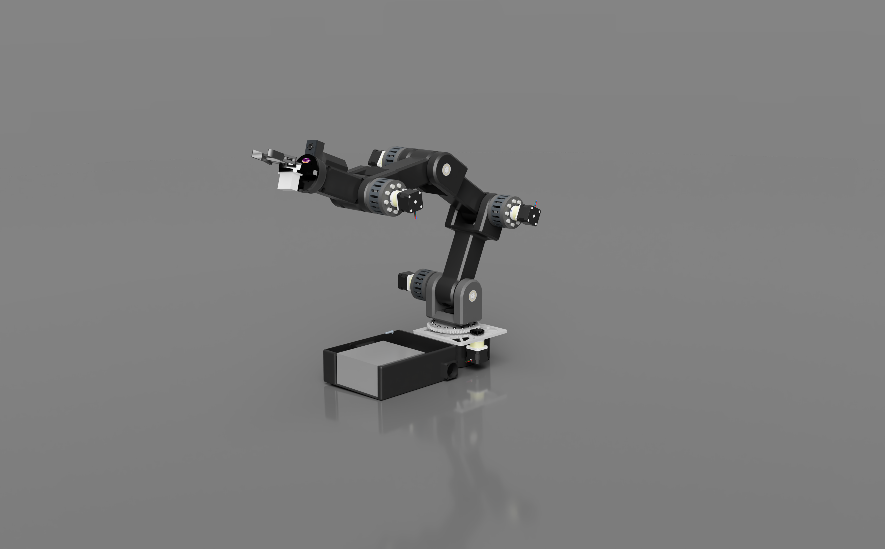
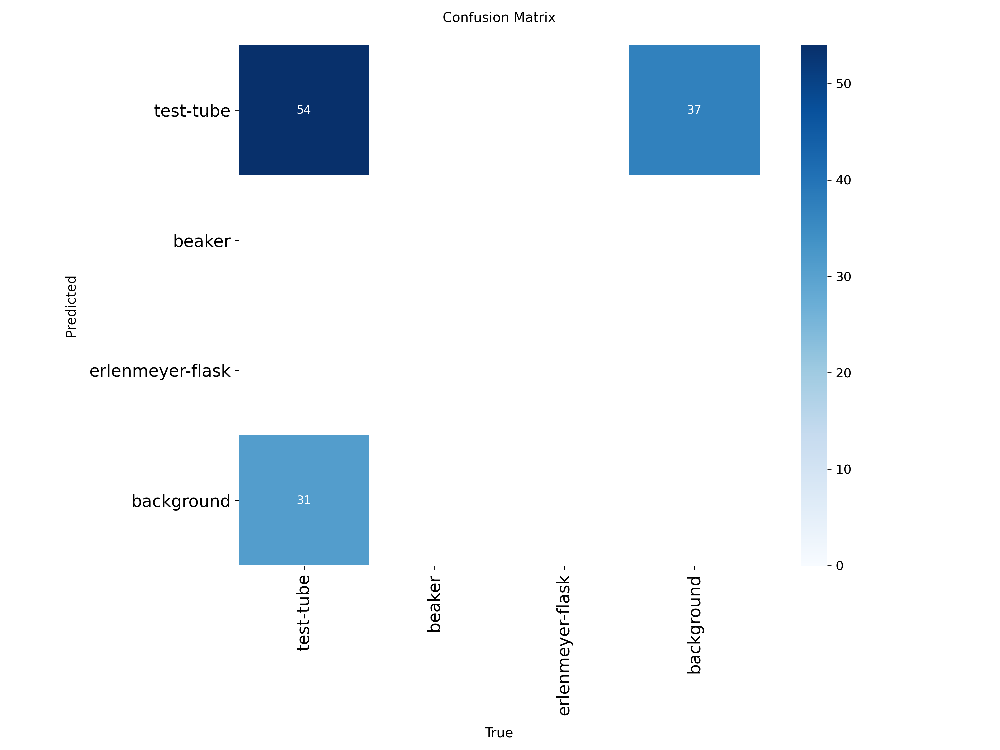

# AI Powered Robotic Arm Lab Assistant

## A customizable, low cost robotic arm created to serve as an educational and lab-based assistant using AI based processing to understand and operate in its environment

## Why we Made This

   We designed this robotic arm to fill a major gap that we observed in educational and laboratory environments. Most advanced tools that assist with automating procedures are extremely expensive and proprietary, which makes  them inaccessible to students and researchers who work in small scale labs who need the most help from this technology. Though the industrial level robotic arms are relatively common in well funded labs and non-educational environments. The high cost and closed ecosystems make this technology inaccessible to classrooms that can use this as an educational tool, community labs, and underfunded research labs.  
   In many labs, repetitive tasks like pipetting, sample transfers, positioning of instruments, and handling hazardous materials are handled manually by the researchers. This seriously limits the possible efficiency of the lab and decreases the possibility of fatigue, human error, and possible safety hazards. The current commercial systems that are capable of automating these tasks cost tens of thousands of dollars and need specialized maintenance because of their closed off design, which makes them really unrealistic for small scale labs and most schools.  
   Our main goal with this design was to create a robotic arm that will help significantly reduce the entry barrier to this technology while still remaining functional, precise, and flexible. By prioritizing the ability to 3D print the majority of the components, open source electronics, and the modular design, we were able to reduce the cost by almost 90% while still creating a highly capable robotic assistant. This arm can be scaled up into a system of communicating assistive devices that can work together. The reduced cost also makes it possible for a high level lab to deploy several of these arms in comparison to a single commercial alternative. This system will help schools with low funding and small labs create a much more hands on learning environment, parallel experiments, and scalable automation of tasks.  
   We chose to make this project fully open source with minimal protections (Reference MIT Licence, txt and CERN Open Hardware Licence Version - Permissive.txt) because we believe that the development of this technology should not be limited by proprietary constraints like mainstream robotics technologies. By releasing all of the CAD files, schematics, and software that we have, we hope that the users of this repository will understand the system itself, repair it on their own, and adapt or even improve on our work. We hope that this approach will encourage learning robotics through taking action and designing independently. We would love for the global community on GitHub to improve the design over time by creating new end effectors, tools, control strategies, and AI algorithms.  
   Overall, this robotic arm was made to spread lab automation. It was designed to not just be a tool for innovation but a platform for developing independent work. We hope that our contribution and efforts here will support education, research, and lab automation by making advanced robotic technologies significantly more affordable and customizable to anyone in the community willing to learn and build this technology further. 

## Images

### 3D CAD Model

*Full assembly*

### AI Performance (Vision)

*Confusion matrix from the YOLOv11 training*

## Bill of Materials

| Item | Description | Quantity | Link |
| :--- | :--- | :--- | :--- |
| Raspberry Pi 5 | 8GB RAM AI Controller | 1 | [Link](https://www.raspberrypi.com/products/raspberry-pi-5/) |
| Arduino Mega | Motor Interface | 1 | [Link](https://store.arduino.cc/products/arduino-mega-2560-rev3) |
| NEMA 17 Stepper | Actuators | 5 | [Link](https://www.adafruit.com/product/324) |
| TMC2209 Driver | Silent Stepper Drivers | 5 | [Link](https://www.google.com/search?q=https://www.bigtreetech.com) |

*update_bom.py is a script
