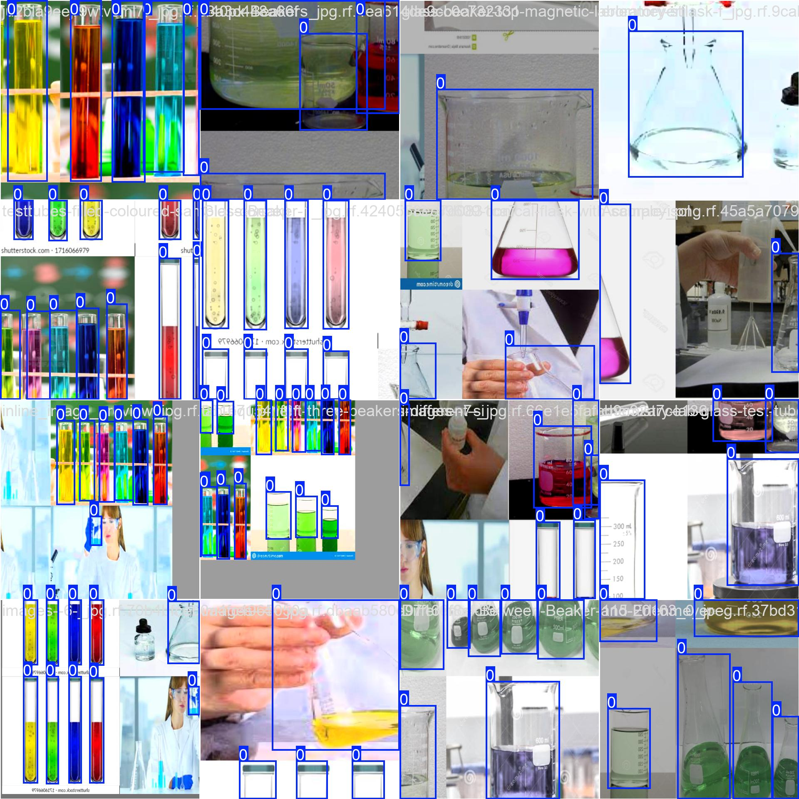

# AI & Software

This folder contains the software and logic behind the systems!

## AI Performance 

We trained a custom YOLO model to identify 3 specific classes of objects. Below are our results:

### 1. Confusion Matrix

This chart shows where the model is strongest.

### 2. Results

These graphs show progress.

### 3. Samples

Here is what the AI sees:

## Folders

### [/rpi](./rpi)
Runs on RPI 5
* `robot_brain.py`: Main Python controller. Hosts a Flask web server
* `lab_items_v1.pt`: Custom-trained weights
* `train_yolo.py`: Used to train the model on my custom dataset.

### [/arduino](./arduino)
Runs on the Arduino Mega
* `motor_control.ino`: Firmware that uses the `AccelStepper` library to move 5 motors at once without freezing